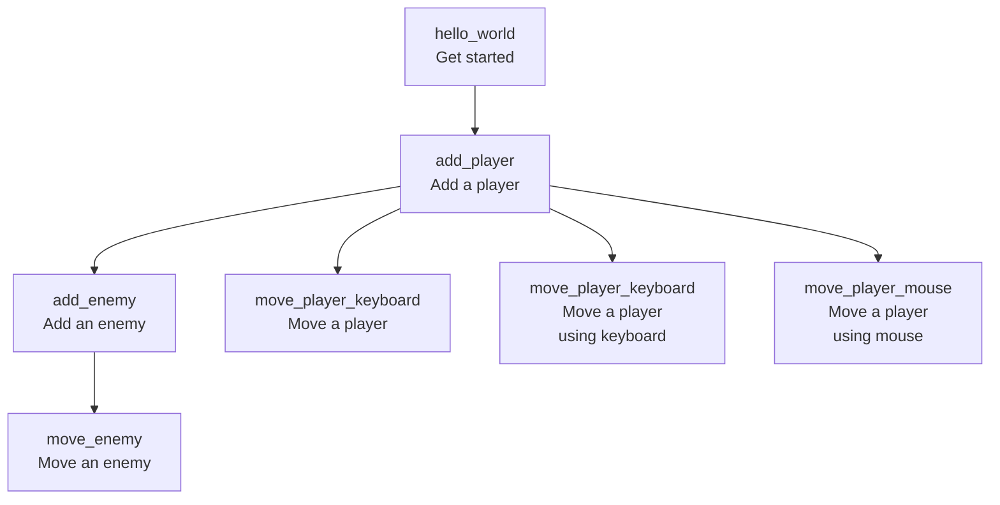

# bevy_tdd_book

Start of a book [1] called 'Developing Bevy games using TDD'.

Bevy is a Rust game engine.

## Goal

Demonstrate how to do Test-Driven Development ('TDD') with Bevy.

## Subgoals

 * Always achieve 100% code coverage, ignoring for the `main` function [3]

## Chapters

Chapter [2]                     |Description
--------------------------------|-----------
[hello_world.md](hello_world.md)|Hello world
[add_player.md](add_player.md)  |Adding a player

## Footnotes

 * [1] 'book' is an overstatement for now: it is just a collection of notes
 * [2] There is no chapter numbering yet
 * [3] One cannot test the `main` function, as this is where a game is started.
   When the game is started, one needs user input to close the game.
   This disallows unit testing
   

## Links

 * [Blog post 'Test-Driven Development in Rust Game Development with Bevy' by Edgardo Carreras](https://edgardocarreras.com/blog/tdd-in-rust-game-engine-bevy/)
