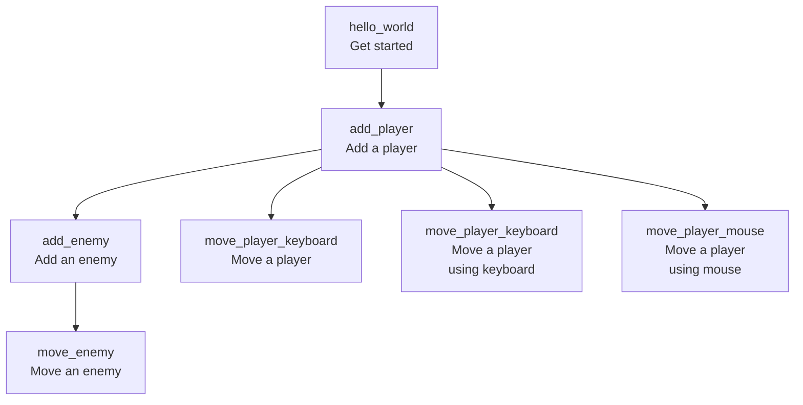

# bevy_tdd_book

Start of a book [1] called 'Developing Bevy games using TDD'.
The goal is to demonstrate how to do Test-Driven Development with Bevy.

* [FAQ](faq.md)

## Chapters

Chapter [2]                     |Description
--------------------------------|-----------
[hello_world.md](hello_world.md)|Hello world
[add_player.md](add_player.md)  |Adding a player

## Files used by continuous integration scripts

Filename                              |Descriptions
--------------------------------------|--------------------------------------------------------------------------------------------------------------------------------------
[mlc_config.json](mlc_config.json)    |Configuration of the link checker, use `markdown-link-check --config mlc_config.json --quiet docs/**/*.md` to do link checking locally
[.spellcheck.yml](.spellcheck.yml)    |Configuration of the spell checker, use `pyspelling -c .spellcheck.yml` to do spellcheck locally
[.wordlist.txt](.wordlist.txt)        |Whitelisted words for the spell checker, use `pyspelling -c .spellcheck.yml` to do spellcheck locally
[.markdownlint.jsonc](.markdownlint.jsonc)|Configuration of the markdown linter, use `markdownlint "**/*.md"` to do markdown linting locally. The name of this file is a default name.
[.markdownlintignore](.markdownlintignore)|Files ignored by the markdown linter, use `markdownlint "**/*.md"` to do markdown linting locally. The name of this file is a default name.

## Footnotes

* [1] 'book' is an overstatement for now: it is just a collection of notes
* [2] There is no chapter numbering yet

## Links

* [Blog post 'Test-Driven Development in Rust Game Development with Bevy' by Edgardo Carreras](https://edgardocarreras.com/blog/tdd-in-rust-game-engine-bevy/)
