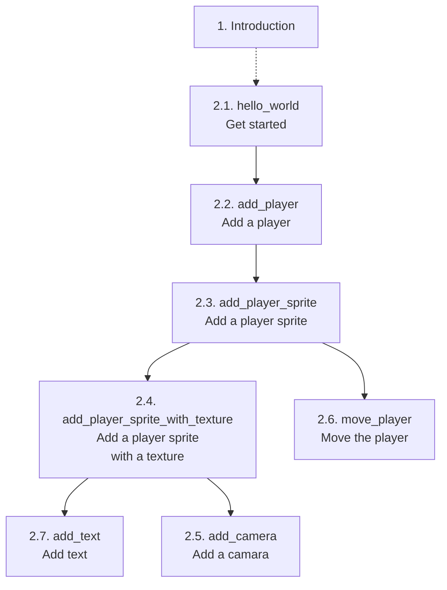
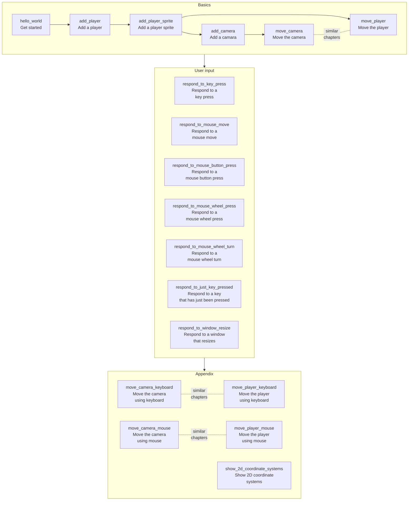

# bevy_tdd_book

Start of a book [1] called 'Developing Bevy games using TDD'.
The goal is to demonstrate how to do Test-Driven Development with Bevy.

- [FAQ](docs/misc/faq.md)

## Chapters

### Section 1: introduction

- [Section 1: Introduction](docs/introductions/main_introduction.md)
- [Section 2: Basics](docs/introductions/basic_introduction.md)

### Section 2: basics

Code                                                                                    |Code coverage                                                                                                                                                                                                          |Chapter                                                                                  |Description                              |Concepts
----------------------------------------------------------------------------------------|-----------------------------------------------------------------------------------------------------------------------------------------------------------------------------------------------------------------------|-----------------------------------------------------------------------------------------|-----------------------------------------|------------------
[code](https://github.com/richelbilderbeek/bevy_tdd_book_hello_world)                   |                                      |2.1. [hello_world.md](docs/chapters/hello_world.md)                                      |Hello world                              |A minimal `App`
[code](https://github.com/richelbilderbeek/bevy_tdd_book_add_player)                    |                                        |2.2. [add_player.md](docs/chapters/add_player.md)                                        |Adding a player                          |Using a marker Component, using a `Query`
[code](https://github.com/richelbilderbeek/bevy_tdd_book_add_player_sprite)             |                          |2.3. [add_player_sprite.md](docs/chapters/add_player_sprite.md)                          |Adding a player sprite                   |Using closures and `SpriteBundles`
[code](https://github.com/richelbilderbeek/bevy_tdd_book_add_player_sprite_with_texture)||2.4. [add_player_sprite_with_texture.md](docs/chapters/add_player_sprite_with_texture.md)|Adding a player sprite with a texture    |Using a texture
[code](https://github.com/richelbilderbeek/bevy_tdd_book_add_text)                      |                                            |2.5. [add_text.md](docs/chapters/add_text.md)                                            |Adding text on screen                    |Using `Text2dBundle`
[code](https://github.com/richelbilderbeek/bevy_tdd_book_add_camera)                    |                                        |2.6. [add_camera.md](docs/chapters/add_camera.md)                                        |Adding a camera                          |Using `Camera2dBundle`
[code](https://github.com/richelbilderbeek/bevy_tdd_book_move_player)                   |                                      |2.7. [move_player.md](docs/chapters/move_player.md)                                      |Move the player                          |Extending a Component

### Section 3: user input

Code                                                                                    |Code coverage                                                                                                                                                                                                          |Chapter [2]                                                                         |Description                              |Concepts
----------------------------------------------------------------------------------------|-----------------------------------------------------------------------------------------------------------------------------------------------------------------------------------------------------------------------|------------------------------------------------------------------------------------|-----------------------------------------|------------------
[code](https://github.com/richelbilderbeek/bevy_tdd_book_respond_to_window_resize)      |            |[respond_to_window_resize.md](docs/chapters/respond_to_window_resize.md)            |Respond to window resize, minimal example|Minimal example, mouse wheel press
[code](https://github.com/richelbilderbeek/bevy_tdd_book_respond_to_key_press)          |                    |[respond_to_key_press.md](docs/chapters/respond_to_key_press.md)                    |Respond to keyboard, minimal example     |Minimal example, key press
[code](https://github.com/richelbilderbeek/bevy_tdd_book_respond_to_just_key_pressed)   |      |[respond_to_just_key_pressed.md](docs/chapters/respond_to_just_key_pressed.md)      |Respond to keyboard, minimal example     |Minimal example, key just being pressed
[code](https://github.com/richelbilderbeek/bevy_tdd_book_respond_to_mouse_move)         |                  |[respond_to_mouse_move.md](docs/chapters/respond_to_mouse_move.md)                  |Respond to mouse, minimal example        |Minimal example, mouse move
[code](https://github.com/richelbilderbeek/bevy_tdd_book_respond_to_mouse_button_press) |  |[respond_to_mouse_button_press.md](docs/chapters/respond_to_mouse_button_press.md)  |Respond to mouse, minimal example        |Minimal example, mouse button press
[code](https://github.com/richelbilderbeek/bevy_tdd_book_respond_to_mouse_wheel_turn)   |      |[respond_to_mouse_wheel_turn.md](docs/chapters/respond_to_mouse_wheel_turn.md)      |Respond to mouse, minimal example        |Minimal example, mouse wheel turn
[code](https://github.com/richelbilderbeek/bevy_tdd_book_respond_to_mouse_wheel_press)  |    |[respond_to_mouse_wheel_press.md](docs/chapters/respond_to_mouse_wheel_press.md)    |Respond to mouse, minimal example        |Minimal example, mouse wheel press

- gamepad

### Section 4: media

- Adding a 3D player with a texture
- 3D models
- drawing
- animations
- sounds

### Appendix

Code                                                                                    |Code coverage                                                                                                                                                                                                          |Chapter [2]                                                                         |Description                              |Concepts
----------------------------------------------------------------------------------------|-----------------------------------------------------------------------------------------------------------------------------------------------------------------------------------------------------------------------|------------------------------------------------------------------------------------|-----------------------------------------|------------------
[code](https://github.com/richelbilderbeek/bevy_tdd_book_move_camera)                   |                                      |[move_camera.md](docs/chapters/move_camera.md)                                      |Move the camera                          |Extending a Component
[code](https://github.com/richelbilderbeek/bevy_tdd_book_move_camera_with_keyboard)     |          |[move_camera_with_keyboard.md](docs/chapters/move_camera_with_keyboard.md)          |Respond to keyboard                      |.
[code](https://github.com/richelbilderbeek/bevy_tdd_book_move_player_with_keyboard)     |          |[move_player_with_keyboard.md](docs/chapters/move_player_with_keyboard.md)          |Respond to keyboard                      |.
[code](https://github.com/richelbilderbeek/bevy_tdd_book_move_camera_with_mouse)        |                |[move_camera_with_mouse.md](docs/chapters/move_camera_with_mouse.md)                |Respond to mouse                         |.
[code](https://github.com/richelbilderbeek/bevy_tdd_book_move_player_with_mouse)        |                |[move_player_with_mouse.md](docs/chapters/move_player_with_mouse.md)                |Respond to mouse                         |.
[code](https://github.com/richelbilderbeek/bevy_tdd_book_show_2d_coordinate_systems)    |        |[show_2d_coordinate_systems.md](docs/chapters/show_2d_coordinate_systems.md)        |Show 2D coordinate systems               |2D coordinate systems

## Chapter overview

## Contributors

These can be found at [docs/misc/contributors.md](docs/misc/contributors.md).

## Files used by continuous integration scripts

Filename                              |Descriptions
--------------------------------------|--------------------------------------------------------------------------------------------------------------------------------------
[mlc_config.json](mlc_config.json)    |Configuration of the link checker, use `markdown-link-check --config mlc_config.json --quiet docs/**/*.md` to do link checking locally
[.spellcheck.yml](.spellcheck.yml)    |Configuration of the spell checker, use `pyspelling -c .spellcheck.yml` to do spellcheck locally
[.wordlist.txt](.wordlist.txt)        |Whitelisted words for the spell checker, use `pyspelling -c .spellcheck.yml` to do spellcheck locally
[.markdownlint.jsonc](.markdownlint.jsonc)|Configuration of the markdown linter, use `markdownlint "**/*.md"` to do markdown linting locally. The name of this file is a default name.
[.markdownlintignore](.markdownlintignore)|Files ignored by the markdown linter, use `markdownlint "**/*.md"` to do markdown linting locally. The name of this file is a default name.

## Links

- [Blog post 'Test-Driven Development in Rust Game Development with Bevy' by Edgardo Carreras](https://edgardocarreras.com/blog/tdd-in-rust-game-engine-bevy/)
