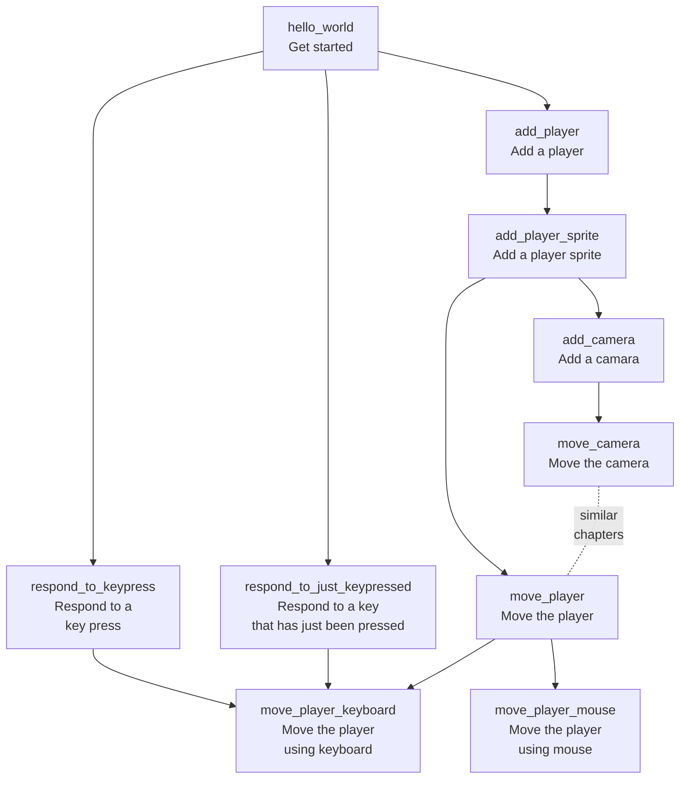

# bevy_tdd_book

Start of a book [1] called 'Developing Bevy games using TDD'.
The goal is to demonstrate how to do Test-Driven Development with Bevy.

* [FAQ](faq.md)

## Chapters

Code                                                                                |Code coverage                                                                                                                                                                                                  |Chapter [2]                                                   |Description                          |Concepts
------------------------------------------------------------------------------------|---------------------------------------------------------------------------------------------------------------------------------------------------------------------------------------------------------------|--------------------------------------------------------------|-------------------------------------|------------------
[code](https://github.com/richelbilderbeek/bevy_tdd_book_hello_world)               |                              |[hello_world.md](hello_world.md)                              |Hello world                          |A minimal `App`
[code](https://github.com/richelbilderbeek/bevy_tdd_book_add_player)                |                                |[add_player.md](add_player.md)                                |Adding a player                      |Using `Components`
[code](https://github.com/richelbilderbeek/bevy_tdd_book_add_player_sprite)         |                  |[add_player_sprite.md](add_player_sprite.md)                  |Adding a player sprite               |Using closures and `SpriteBundles`
[code](https://github.com/richelbilderbeek/bevy_tdd_book_add_camera)                |                                |[add_camera.md](add_camera.md)                                |Adding a camera                      |Using closures and `Camera2dBundle`
[code](https://github.com/richelbilderbeek/bevy_tdd_book_move_player)               |                              |[move_player.md](move_player.md)                              |Move the player                      |Extending a structure, using a `Query`
[code](https://github.com/richelbilderbeek/bevy_tdd_book_move_camera)               |                              |[move_camera.md](move_camera.md)                              |Move the camera                      |.
[code](https://github.com/richelbilderbeek/bevy_tdd_book_move_player_with_keyboard) |  |[move_player_with_keyboard.md](move_player_with_keyboard.md)  |Respond to keyboard                  |.
[code](https://github.com/richelbilderbeek/bevy_tdd_book_respond_to_keypress)       |              |[respond_to_keypress.md](respond_to_keypress.md)              |Respond to keyboard, minimal example |Minimal example, key press
[code](https://github.com/richelbilderbeek/bevy_tdd_book_respond_to_just_keypressed)||[respond_to_just_keypressed.md](respond_to_just_keypressed.md)|Respond to keyboard, minimal example |Minimal example, key just being pressed

## Chapter overview

## Files used by continuous integration scripts

Filename                              |Descriptions
--------------------------------------|--------------------------------------------------------------------------------------------------------------------------------------
[mlc_config.json](mlc_config.json)    |Configuration of the link checker, use `markdown-link-check --config mlc_config.json --quiet docs/**/*.md` to do link checking locally
[.spellcheck.yml](.spellcheck.yml)    |Configuration of the spell checker, use `pyspelling -c .spellcheck.yml` to do spellcheck locally
[.wordlist.txt](.wordlist.txt)        |Whitelisted words for the spell checker, use `pyspelling -c .spellcheck.yml` to do spellcheck locally
[.markdownlint.jsonc](.markdownlint.jsonc)|Configuration of the markdown linter, use `markdownlint "**/*.md"` to do markdown linting locally. The name of this file is a default name.
[.markdownlintignore](.markdownlintignore)|Files ignored by the markdown linter, use `markdownlint "**/*.md"` to do markdown linting locally. The name of this file is a default name.

## Contributors

These are people that helped me:

* `kristoff3r`: answered a question on the Bevy Discord channel
* `Periwinkle`: answered a question on the Bevy Discord channel
* Shane Celis: helped answer a question on the Bevy Discord channel
* `Ziven`: helped answer a question on the Bevy Discord channel

## Footnotes

* [1] 'book' is an overstatement for now: it is just a collection of notes
* [2] There is no chapter numbering yet

## Links

* [Blog post 'Test-Driven Development in Rust Game Development with Bevy' by Edgardo Carreras](https://edgardocarreras.com/blog/tdd-in-rust-game-engine-bevy/)
