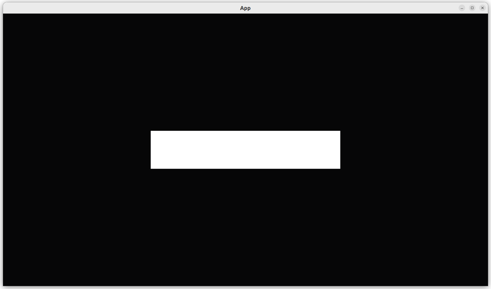

# Add camera

## First test

```rust
#[test]
fn test_empty_app_has_no_camera() {
    let mut app = App::new();
    app.update();
    assert!(!has_camera(&app));
}
```

## Second test

```rust
#[test]
fn test_app_has_a_camera() {
    let mut app = create_app(create_default_game_parameters());
    app.update();
    assert!(has_camera(&app));
}
```

## Third test

```rust
#[test]
fn test_get_camera_scale() {
    let mut app = create_app(create_default_game_parameters());
    app.update();
    assert_eq!(get_camera_scale(&mut app), 1.0);
}
```

## Fourth test

```rust
#[test]
fn test_initial_camera_scale() {
    assert_eq!(create_default_game_parameters().initial_camera_scale, 1.0);
}
```

## Fifth test


```rust
#[test]
fn test_game_parameters_use_camera_scale() {
    let custom_camera_scale: f32 = 5.0;
    let mut params = create_default_game_parameters();
    params.initial_camera_scale = custom_camera_scale;
    let mut app = create_app(params);
    app.update();
    assert_eq!(get_camera_scale(&mut app), custom_camera_scale);
}
```

## Running `main`

```rust
fn main() {
    let mut params = create_default_game_parameters();
    params.initial_camera_scale = 0.2;
    let mut app = create_app(params);
    app.add_plugins(DefaultPlugins);
    app.run();
}
```



## Conclusion

We can now create an `App` with a camera.
When running the `App`, a rectangle is displayed.
However, we do have tested everything that the App does!

Full code can be found at [https://github.com/richelbilderbeek/bevy_tdd_book_add_camera](https://github.com/richelbilderbeek/bevy_tdd_book_add_camera).
