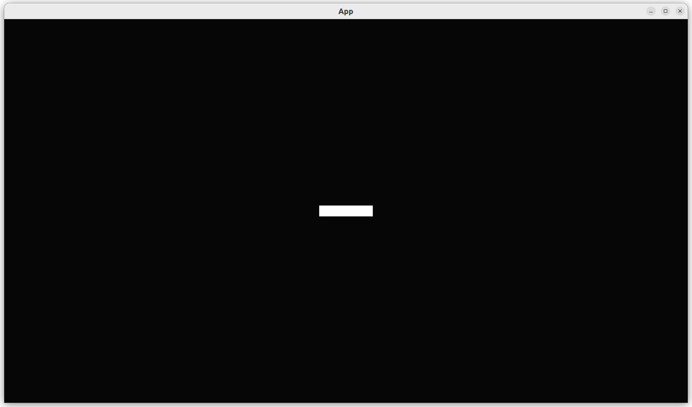
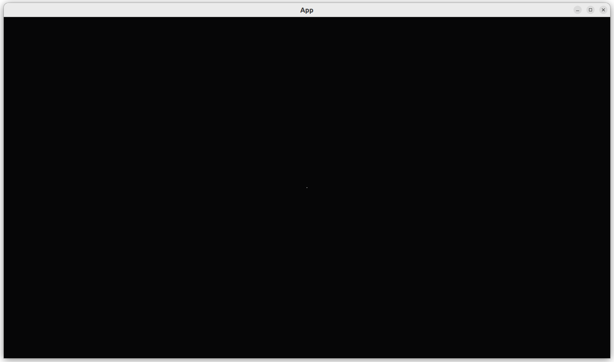

# Add player sprite

This chapter shows how to add a player sprite to a game.

## First test: an empty `App` has no players

```rust
fn test_empty_app_has_no_players() {
    let mut app = App::new();
    assert_eq!(count_n_players(&mut app), 0);
}
```

## First fix

```rust
fn count_n_players(app: &mut App) -> usize {
    let mut query = app.world_mut().query::<(&Transform, &Player)>();
    return query.iter(app.world_mut()).len();
}
```

## Second test: our `App` has a player

```rust
fn test_create_app_has_a_player() {
    let mut app = create_app();
    app.update();
    assert_eq!(count_n_players(&mut app), 1);
}
```

## Second fix

To store a player, here a `Player` marker component is created:

```rust
#[derive(Component)]
pub struct Player;
```

In `create_app`, an empty `App` is created, after which a player is added:

```rust
pub fn create_app(initial_player_position: Vec2, initial_player_scale: Vec2) -> App {
    let mut app = App::new();
    app.add_systems(Startup, add_player);
    app
}
```

Adding a player in practice is combining a `SpriteBundle` with the
`Player` marker component:

```rust
fn add_player(mut commands: Commands) {
    commands.spawn((
        SpriteBundle {
            ..default()
        },
        Player,
    ));
}
```

## Third test: a player has a coordinate

```rust
fn test_get_player_position() {
    let initial_player_position = Vec2::new(1.2, 3.4);
    let mut app = create_app(initial_player_position);
    app.update();
    assert_eq!(get_player_position(&mut app), initial_player_position);
}
```

## Third fix

We use a two-dimensional vector, as we only use the x and y axis:

```rust
fn get_player_position(app: &mut App) -> Vec2 {
    let mut query = app.world_mut().query::<(&Transform, &Player)>();
    let (transform, _) = query.single(app.world());
    transform.translation.xy()
}
```

We need to adept `create_app` to store a player's position:

```rust
pub fn create_app(initial_player_position: Vec2) -> App {
    let mut app = App::new();
    let add_player_fn = move |/* no mut? */ commands: Commands| {
        add_player(commands, initial_player_position);
    };
    app.add_systems(Startup, add_player_fn);
    app
}
```

The most complex lines are where the `add_player_fn` function
is created using a closure:
`app.add_systems` expects to receive function that works on `Commands`,
without any extra parameters. This means that
`app.add_systems(Startup, add_player)` would not fit,
as `add_player` expect an initial position as well.
The technique to make a partially evaluated function we use here is called
a 'closure': we create a function that only works on `Commands` (i.e.
the part between vertical bars).
The closure then uses the `initial_player_position` when needed.

In `add_player`, the initial player position is stored in the `Transform`.
The two-dimensional position is extended to have a z-coordinat of zero,
as Bevy does always use three-dimensional coordinates.

```rust
fn add_player(mut commands: Commands, initial_player_position: Vec2) {
    commands.spawn((
        SpriteBundle {
            transform: Transform {
                translation: Vec2::extend(initial_player_position, 0.0),
                ..default()
            },
            ..default()
        },
        Player,
    ));
}
```

## Fourth test: a player has a scale

```rust
fn test_player_has_a_custom_scale() {
    let initial_player_position = Vec2::new(1.2, 3.4);
    let initial_player_scale = Vec2::new(64.0, 32.0);
    let mut app = create_app(initial_player_position, initial_player_scale);
    app.update();
    assert_eq!(get_player_scale(&mut app), initial_player_scale);
}
```

## Fourth fix

We use a two-dimensional vector, as we only use the x and y axis:

```rust
fn get_player_scale(app: &mut App) -> Vec2 {
    let mut query = app.world_mut().query::<(&Transform, &Player)>();
    let (transform, _) = query.single(app.world());
    transform.scale.xy()
}
```

Rewrite part of `create_app` to allow for a two-dimensional scale:

```rust
pub fn create_app(initial_player_position: Vec2, initial_player_scale: Vec2) -> App {
    let mut app = App::new();
    let add_player_fn = move |/* no mut? */ commands: Commands| {
        add_player(commands, initial_player_position, initial_player_scale);
    };
    app.add_systems(Startup, add_player_fn);
    app
}
```

Store the player scale in the `Transform`.
The two-dimensional scale is extended to have a z-coordinat of 1.0,
which is assumed for two-dimensional games.

```rust
fn add_player(mut commands: Commands, initial_player_position: Vec2, initial_player_scale: Vec2) {
    commands.spawn((
        SpriteBundle {
            transform: Transform {
                translation: Vec2::extend(initial_player_position, 0.0),
                scale: Vec2::extend(initial_player_scale, 1.0),
                ..default()
            },
            ..default()
        },
        Player,
    ));
}
```

## `main.rs`

```rust
fn main() {
    let initial_player_position = Vec2::new(0.0, 0.0);
    let initial_player_scale = Vec2::new(64.0, 32.0);
    let mut app = create_app(initial_player_position, initial_player_scale);
    let add_camera_fun = |mut commands: Commands| {
        commands.spawn(Camera2dBundle::default());
    };
    app.add_systems(Startup, add_camera_fun);
    app.add_plugins(DefaultPlugins);
    app.run();
}
```



Setting `initial_player_scale` to the default `(1.0, 1.0)` will result in the player
being 1x1 pixels big:



## Conclusion

We can now create an `App` with one player sprite,
where the player has, among others, a position and scale.
When running the `App`, we can see the player.
We have tested everything that the App does!

Full code can be found at [https://github.com/richelbilderbeek/bevy_tdd_book_add_player_sprite](https://github.com/richelbilderbeek/bevy_tdd_book_add_player_sprite).
