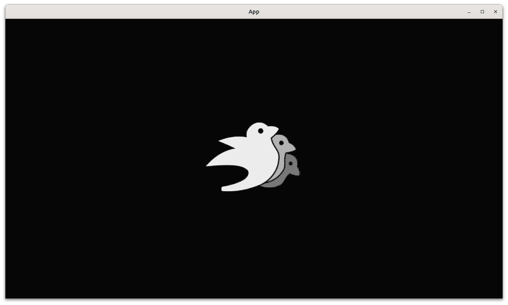

# Add player sprite with a texture

This chapter shows how to add a player sprite with a texture to a game.
This allows us to use images in our game.



## First tests

Our first tests are the same as earlier chapters,
forcing us to write `create_app`, `count_n_players` and
the `Player` component:

```rust
fn test_empty_app_has_no_players() {
    let mut app = App::new();
    app.update();
    assert_eq!(count_n_players(&mut app), 0);
}

fn test_our_app_has_a_player() {
    let mut app = create_app();
    app.update();
    assert_eq!(count_n_players(&mut app), 1);
}
```

The previous chapter discusses these steps in details.

## Third test: our player has a default scale

The image will be displayed at its original 1:1 scale:


```rust
fn test_player_has_the_default_size() {
    let mut app = create_app();
    app.update();
    assert_eq!(get_player_scale(&mut app), Vec2::new(1.0, 1.0));
}
```

## Third fix

Although the function name `get_player_scale` is new, it has
exactly the same implementation as `get_player_size` in the previous chapter:

```rust
fn get_player_scale(app: &mut App) -> Vec2 {
    let mut query = app.world_mut().query::<(&Transform, &Player)>();
    let (transform, _) = query.single(app.world());
    transform.scale.xy()
}
```

In the context of using an image, it is more natural to work with a
scale than with a size.


## Fourth test: our player has a texture

Now for the texture:

```rust
fn test_player_has_a_texture() {
    let mut app = create_app();
    app.update();
    assert!(get_player_has_texture(&mut app));
}
```

## Fourth fix

The seemingly innocent test above, forces us into a complex fix:

- Write the `get_player_has_texture` function
- Modify the `create_app` function
- Write the `add_player` function

The `get_player_has_texture` function contains a query similar to what
we know:

```rust
fn get_player_has_texture(app: &mut App) -> bool {
    let mut query = app.world_mut().query::<(&Handle<Image>, &Player)>();
    let (handle, _) = query.single(app.world());
    handle.is_strong()
}
```

There are two new elements:

- `&Handle<Image>`: this reads as 'a handle to an image'.
  This data type is chosen from 
  [the Bevy documentation of `SpriteBundle`](https://docs.rs/bevy/latest/bevy/prelude/struct.SpriteBundle.html),
  as it is the data type of the `SpriteBundle` field called `texture`.
  A 'handle to an image' is a lightweight way to work with images, similar
  to the Rust `box` class: both can be copied and cloned and ... empty 
- `handle.is_strong()` determines if the handle indeed refers to an image
  that is actually (being) loaded

The `create_app` function may look like this:

```rust
pub fn create_app() -> App {
    let mut app = App::new();

    if cfg!(test) {
        app.add_plugins(AssetPlugin::default());
        app.add_plugins(TaskPoolPlugin::default());
        app.init_asset::<bevy::render::texture::Image>();
    }
    app.add_systems(Startup, add_player);

    app
}
```

The `if` statement and its body are new, I unpack it here:

- `if cfg!(test) { ... }` is read as 'when running tests, run the code
  between curly brackets'. This means that this code is ignored when
  running our game from the `main` function
- `app.add_plugins(AssetPlugin::default())`: add the default `AssetPlugin`
- `app.add_plugins(TaskPoolPlugin::default())`: add the default `TaskPoolPlugin`
- `app.init_asset::<bevy::render::texture::Image>()`: initialize the `Image`
  asset

A plugin is a combination of entities, components and systems that work
together to archieve a goal. It is a unit of modularity: you can put these
in a Rust crate and become part of the Bevy ecosystem.

With the `AssetPlugin` present, we need to initialize it to allow for
working with images.

Note that one only needs to remember to add the `AssetPlugin`: the following
two lines are taken from helpful error messages.

The `add_player` function may look like this:

```rust
fn add_player(mut commands: Commands, asset_server: Res<AssetServer>) {
    commands.spawn((
        SpriteBundle {
            texture: asset_server.load("bevy_bird_dark.png"),
            ..default()
        },
        Player,
    ));
}
```

The biggest surprise is the `asset_server: Res<AssetServer>`:
apparently, when adding a Bevy system, one can 'magically' get
access to an `asset_server` of datatype `Res<AssetServer>`. 
A `Res` is a unique Bevy resource, in this case of type `AssetServer`:
a structure for assets.

The creation of the player's `SpriteBundle` is similar too, except for
`texture: asset_server.load("bevy_bird_dark.png")`, where a texture is
loaded from file by the asser server. For this to work, that file (in this
case, `bevy_bird_dark.png`) must be present in the `assets` folder 
of the Rust project.

## `main.rs`

The `main` function has not changed at all:

```rust
fn main() {
    let mut app = create_app();
    let add_camera_fun = |mut commands: Commands| {
        commands.spawn(Camera2dBundle::default());
    };
    app.add_systems(Startup, add_camera_fun);
    app.add_plugins(DefaultPlugins);
    app.run();
}
```

## Conclusion

We can now create an `App` with a player sprite that has a texture.
When running the `App`, we can see the player.
We have tested everything that the App does!

Full code can be found at [https://github.com/richelbilderbeek/bevy_tdd_book_add_player_sprite_with_texture](https://github.com/richelbilderbeek/bevy_tdd_book_add_player_sprite_with_texture).
