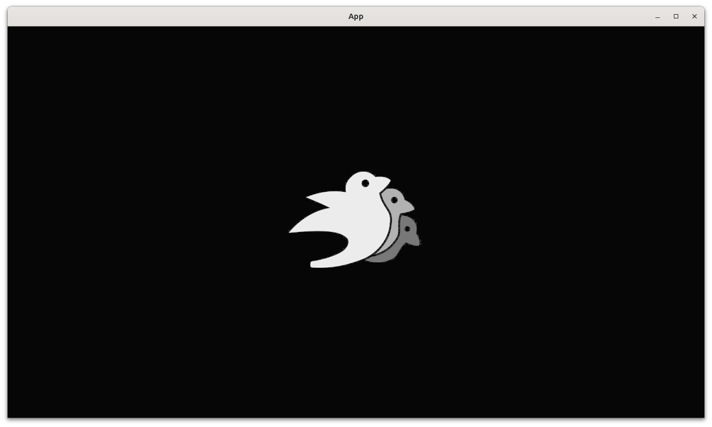
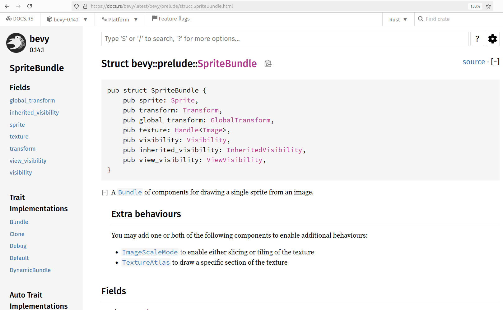

---
tags:
  - chapter
  - add
  - player
  - sprite
  - texture
---

# 2.5. Add player sprite with a texture

This chapter shows how to add a player sprite with a texture to a game.
This allows us to use images in our game.



This chapter introduces:

- The Bevy `Handle`
- The Bevy `Image`
- `cfg!(test)`, an `if` statement only true during testing
- Adding the `AssetPlugin` and `TaskPoolPlugin`
- Initializing a Bevy image
- Where to put assets (i.e. images, sounds, etc.)
- Loading an image from file using `AssetServer`


## 2.5.1. First tests

Our first tests are the same as in earlier chapters,
forcing us to write `create_app`, `count_n_players` and
the `Player` component:

```rust
fn test_empty_app_has_no_players() {
    let mut app = App::new();
    app.update();
    assert_eq!(count_n_players(&mut app), 0);
}

fn test_our_app_has_a_player() {
    let mut app = create_app();
    app.update();
    assert_eq!(count_n_players(&mut app), 1);
}
```

See the ['Add a player'](add_player.md) chapter for the implementations
and an in-depth discussion.

There is one big difference in these tests: `app.update` is called
in each test! In all earlier chapters, we called `app.update`
at the end of the `create_app` function.
In this chapter, we don't, because doing so finalizes the `App`
too early and this will cause that our game
to panic in the `main` function (hence we cannot play the game).
This will be discussed in both the `create_app` and
the `main` function paragraph.

## 2.5.2. Third test: our player has a default scale

In [the 'Add a player sprite' chapter](add_player_sprite.md)
the size of the player's sprite was set to its
size (i.e width and height) in pixels, using
the `scale` of a player's `Transform`. In that context,
`scale` is a misnomer: it indicates the size of the player (and not the
scale).

When using an image, 'scale' is nicely named: an image
has its inherent size in pixels, where `scale`
will scale the image up or down. When the scale is set to one,
an image will be displayed at its original 1:1 scale.
In Bevy, a scale has three dimensions.

Here we test that the scale of our image is one in both two
dimensions, as we are working on as 2D game. We will later assert
that the scale in the third dimension is one too.

Here is the test:

```rust
fn test_player_has_the_default_scale() {
    let mut app = create_app();
    app.update();
    assert_eq!(get_player_scale(&mut app), Vec2::new(1.0, 1.0));
}
```

## 2.5.3. Third fix

Although the function name `get_player_scale` is new, it has
exactly the same implementation as `get_player_size` in the previous chapter:

```rust
fn get_player_scale(app: &mut App) -> Vec2 {
    let mut query = app.world_mut().query::<(&Transform, &Player)>();
    let (transform, _) = query.single(app.world());
    assert_eq!(transform.scale.z, 1.0); // 2D
    transform.scale.xy()
}
```

In the context of using an image, it is more natural to work with a
scale than with a size.

## 2.5.4. Fourth test: our player has a texture

Now for the texture:

```rust
fn test_player_has_a_texture() {
    let mut app = create_app();
    app.update();
    assert!(get_player_has_texture(&mut app));
}
```

## 2.5.5. Fourth fix

The seemingly innocent test above, forces us into a complex fix:

- Write the `get_player_has_texture` function
- Modify the `create_app` function
- Write the `add_player` function

The `get_player_has_texture` function contains a query similar to what
we know:

```rust
fn get_player_has_texture(app: &mut App) -> bool {
    let mut query = app.world_mut().query::<(&Sprite, &Player)>();
    let (sprite, _) = query.single(app.world());
    sprite.image.is_strong()
}
```

There are two new elements:

- `&Handle<Image>`: this reads as 'a handle to an image'.
  This data type is chosen from
  [the Bevy documentation of `Sprite`](https://docs.rs/bevy/latest/bevy/prelude/struct.Sprite.html)
  (see below),
  as it is the data type of the `Sprite` field called `texture`.
  A 'handle to an image' is a lightweight way to work with images, similar
  to the Rust `box` class: both can be copied and cloned and ... empty
- `handle.is_strong()` determines if the handle indeed refers to an image
  that is actually (being) loaded



> Part of the Bevy Sprite documentation

The `create_app` function may look like this:

```rust
pub fn create_app() -> App {
    let mut app = App::new();

    if cfg!(test) {
        app.add_plugins(AssetPlugin::default());
        app.add_plugins(TaskPoolPlugin::default());
        app.init_asset::<bevy::render::texture::Image>();
    }
    app.add_systems(Startup, add_player);

    app
}
```

The `if` statement and its body are new, I unpack it here:

- `if cfg!(test) { ... }` is read as 'when running tests, run the code
  between curly brackets'. This means that this code is ignored when
  running our game from the `main` function
- `app.add_plugins(AssetPlugin::default())`: add the default `AssetPlugin`
- `app.add_plugins(TaskPoolPlugin::default())`: add the default `TaskPoolPlugin`
- `app.init_asset::<bevy::render::texture::Image>()`: initialize the `Image`
  asset

A plugin is a combination of entities, components and systems that work
together to achieve a goal. It is a unit of modularity: you can put these
in a Rust crate and become part of the Bevy ecosystem.

With the `AssetPlugin` present, we need to initialize it to allow for
working with images.
Note that one only needs to remember to add the `AssetPlugin`: the following
two lines were copied from helpful error messages.

Adding the default plugins (called `DefaultPlugins`) seems like
a good idea: one can be sure that the most important plugins
are present. The problem with this, however, is that will turn
our program into a full-blown application with a window that
needs to be closed by a user. Our tests should run without
user input, hence we cannot use all the default plugins.
Instead, we only add the plugins we need for testing in a build
that runs the test.

The reason why we do not add `app.update()` to the `create_app` function
is because of the `if cfg!(test)`: as a consequence of this if statement,
running the tests will differ from running the game: the test build
will have two plugins added and one asset initialized,
where this will not be done when running the game normally.
When running the game normally with an `app.update()` in the end,
the program will panic, because `add_player` is called *without*
the needed plugins. This problem is solved by, in `main`,
adding the (many more) plugins there.

The `add_player` function may look like this:

```rust
fn add_player(mut commands: Commands, asset_server: Res<AssetServer>) {
    commands.spawn((
        Sprite::from_image(asset_server.load("bevy_bird_dark.png")),
        Player,
    ));
}
```

The biggest surprise is the `asset_server: Res<AssetServer>`:
apparently, when adding a Bevy system, one can 'magically' get
access to an `asset_server` of datatype `Res<AssetServer>`.
A `Res` is a unique Bevy resource, in this case of type `AssetServer`:
a structure for assets.

The creation of the player's `Sprite` is similar too, except for
`texture: asset_server.load("bevy_bird_dark.png")`, where a texture is
loaded from file by the assets server. For this to work, that file (in this
case, `bevy_bird_dark.png`) must be present in the `assets` folder
of the Rust project.

## 2.5.6. `main.rs`

The `main` function has not changed at all:

```rust
fn main() {
    let mut app = create_app();
    let add_camera_fn = |mut commands: Commands| {
        commands.spawn(Camera2d);
    };
    app.add_systems(Startup, add_camera_fn);
    app.add_plugins(DefaultPlugins);
    app.run();
}
```

The reason why we did not add `app.update()` to the `create_app` function
is because of that we add the default plugins here.
Would the plugins from the test build already have been added,
this would cause our program to panic: Bevy asserts
that a plugin is not added twice.
Because the plugins we add in our test build are part of the
default plugins added in our `main` function,
we need a mechanism to have the right plugins added to the right build.
Only after adding the default plugins here should our `App` be updated,
as calling `app.update` (which will be done by `app.run`) will assume
that the plugin for the `AsserServer` is loaded.

Here is how our game looks like:


## 2.5.7. Conclusion

We can now create an `App` with a player sprite that has a texture.
When running the `App`, we can see the player.
We have tested everything that the App does!

Full code can be found at [https://github.com/richelbilderbeek/bevy_tdd_book_add_player_sprite_with_texture](https://github.com/richelbilderbeek/bevy_tdd_book_add_player_sprite_with_texture).
