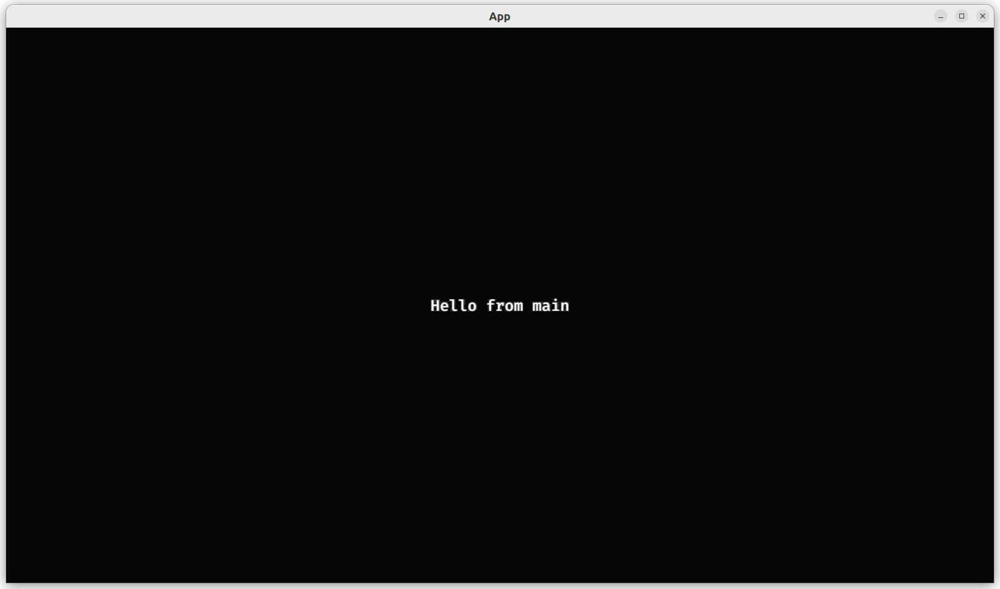

# 2.6. Add text

This chapter shows how to add a text to a game.



This chapter introduces:

- The Bevy `TextBundle`

## 2.6.1. First test: an `App` has no text

Similar to earlier chapters,
we'll start our game development for counting the number
of texts to be zero:

```rust
fn test_empty_app_has_text() {
    let mut app = App::new();
    assert_eq!(count_n_texts(&mut app), 0);
}
```

## 2.6.2. First fix

Taking a look at
[the Bevy `TextBundle` documentation](https://docs.rs/bevy/latest/bevy/prelude/struct.TextBundle.html),
one can see that there is a field called `text` of data type `Text`.
We'll use that -and only that- for our query:

```rust
fn count_n_texts(app: &mut App) -> usize {
    let mut query = app.world_mut().query::<&Text>();
    return query.iter(app.world()).len();
}
```

This query is probably (and indeed is!) good enough,
as it will not conflict with the Bevy entities that are added
by the default plugins. This was different from when we were querying
for a player's `Transform`, as a default camera also has a `Transform`
Component, hence we had to use a `Player` marker component to get access
to the right `Transform`.

## 2.6.3. Second test: can create an `App` with text

As our game will show a text, we'll have to be able to pass our
desired text to it. We do so using a `create_app` function:

```rust
fn test_can_create_app_from_str() {
    create_app(String::from("irrelevant"));
}
```

The `String` used by Bevy is the standard Rust `String`.
We could just as well have picked to use a string slice instead,
but this approach felt better.

## 2.6.4. Second fix

All that this test forces us to do, is to write a `create_app`
function that accepts a `String`. Here is an example stub
that will pass the test:

```text
pub fn create_app(_text: String) -> () {}
```

## 2.6.5. Third test: an `App` has text

Now we force the app to actually store the text in an entity:

```rust
fn test_app_has_text() {
    let mut app = create_app(String::from("irrelevant"));
    app.update();
    assert_eq!(count_n_texts(&mut app), 1);
}
```

## 2.6.6. Third fix

To make this test pass, we need to:

- Write `create_app` to pass on the `String` to a `add_text` function
- Write an `add_text` function to add a component with that `String`

The `create_app` is quite similar to versions is earlier chapters:

```rust
pub fn create_app(text: String) -> App {
    let mut app = App::new();
    let add_text_fn = move |commands: Commands| add_text(commands, &text);
    app.add_systems(Startup, add_text_fn);
    app
}
```

Also in this incarnation of `create_app`, we use a closure to be able
to fit our `add_text` function in the `app.add_systems` member function.

The `add_text` function may look like this:

```rust
fn add_text(mut commands: Commands, str: &String) {
    commands.spawn(Text2dBundle {
        text: Text::from_section(str, TextStyle { ..default() }),
        ..default()
    });
}
```

Most of this function is similar to adding a `SpriteBundle`.
It may come as a surprise that the `text` field is more than just
a `String`: a `Text` contains multiple `TextSection`s.

## 2.6.7. Fourth test: an `App` has the correct text

In the final test we assure that our desired text is actually stored
by our application:

```rust
fn test_app_uses_text() {
    let text = String::from("some random text");
    let mut app = create_app(text.clone());
    app.update();
    assert_eq!(get_text(&mut app), text);
}
```

## 2.6.8. Fourth fix

If your implementations matched the earlier fixes, this test would already
pass. In case you've cut a corner, this is the test that will force you to
write a non-stub implementation.

## 2.6.9. `main.rs`

The resulting `main` function is not much different than we are used to:

```rust
fn main() {
    let text = String::from("Hello from main");
    let mut app = create_app(text);
    let add_camera_fun = |mut commands: Commands| {
        commands.spawn(Camera2dBundle::default());
    };
    app.add_systems(Startup, add_camera_fun);
    app.add_plugins(DefaultPlugins);
    app.run();
}
```


## 2.6.10. Conclusion

We can now create an `App` with a text.
We have tested everything that the App does!

Full code can be found at [https://github.com/richelbilderbeek/bevy_tdd_book_add_text](https://github.com/richelbilderbeek/bevy_tdd_book_add_text).
