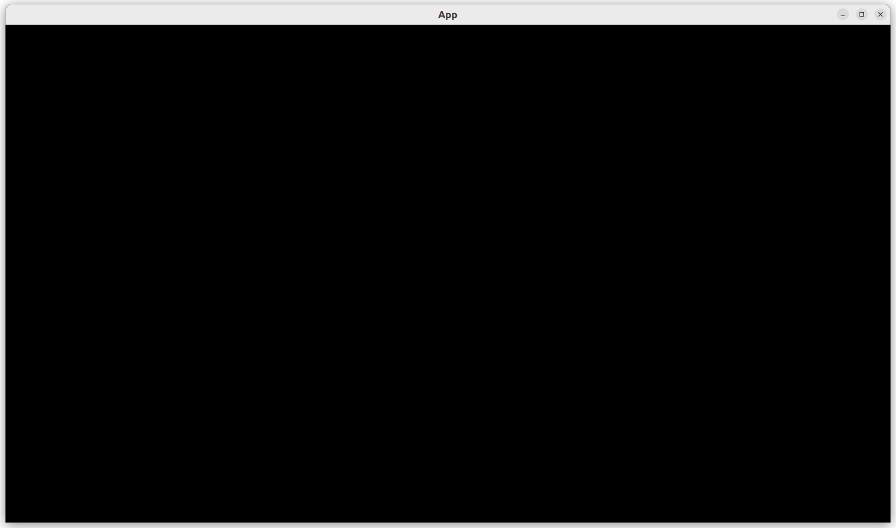
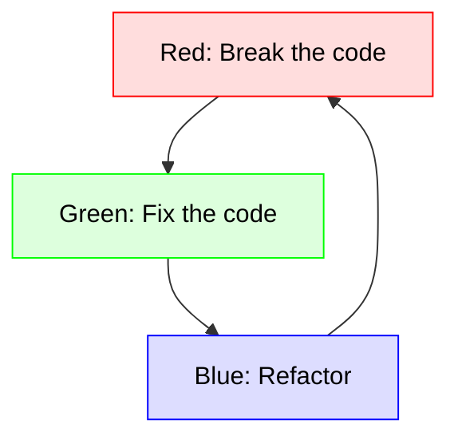

# 2.2. Hello world

This chapter is about creating a minimal Bevy program that is completely tested.



This chapter introduces:

- The Bevy `App`
- Test-Driven Development ('TDD')
- Types of implementations
- Code coverage.
- The `create_app` function

## 2.2.1. Test-Driven Development

Test-Driven Develop, or TDD, is a software methodology to develop
computer code in a systematic way,
that is known to improve code quality `[Alkaoud & Walcott, 2018]`
`[Janzen & Saiedian, 2006]`.

To develop code with TDD, one does many, usually short (think minutes!)
TDD cycles. A TDD cycle has three steps:

- Red: write a test that breaks the code
- Green: fix the test
- Blue: cleanup



This book follows these cycles, by first showing the test(s),
then their fixes.

## 2.2.2. First test: `create_app` should not crash

Our first test is about creating a computer program that uses the Bevy game library.
The Bevy class for this, is called [`App`](https://docs.rs/bevy/latest/bevy/app/struct.App.html).
Hence, we call the function to create a Bevy program `create_app`.

Our first trivial test will be if `create_app` does something,
i.e. it does not crash:

```rust
#[test]
fn test_can_create_app() {
    create_app();
}
```

The test is the line `create_app();`, the rest is scaffolding:

- `#[test]` indicates that the next function must be run when running all tests
- `fn test_can_create_app() {` and `}` indicate the name, start and end of
  a function called `test_can_create_app`
- `create_app();` calls a function called `create_app`.

This test will break the code, as the function `create_app` does not exist yet,
so the Rust compiler will give an error message.
This allows us to make our dreams come true and
write that `create_app` function!

## 2.2.3. First fix

Here is a possible implementation of `create_app`:

```rust
pub fn create_app() -> App {
    App::new()
}
```

All it does is create a new Bevy `App` and return it.
This will pass our test!

## 2.2.4. Types of implementations

The implementation of `create_app` shown above is a complete implementation:
it does what it is expected to do completely.
However, there are other implementations possible:

- implementations that do not follow the recommended Rust style
- implementations that are stubs

Here is an implementation that does not follow
the recommended Rust style:

```text
pub fn create_app() -> App {
    return App::new();
}
```

Following a consistent coding style improves software quality `[Fang, 2001]`.
All code shown in this book is tested to follow the
Rust style recommended by the `clippy` crate.

Here is an implementation that is a stub:

```text
pub fn create_app() -> () {}
```

In software development, a 'stub' is 'a start of something'. The
purpose of a stub is to, for example, start the architectural setup.
This stub will pass all tests and hence is acceptable too.
If one chooses to write a stub like this,
one will need to write an addition test, that, for example, checks
if the return value of `create_app` is indeed of type `App`.

## 2.2.5. `main.rs`

The `main` function will not be used in automated testing,
as it starts our game. This is useful to play the game,
but not for testing.
For testing to be done automatically, it is required
that there is no user input.
Starting the game will require at least
that a user needs to do something to close it.
Hence, the `main` function is useless for testing.

Instead, the `main` function 'just' runs the `App`.

```rust
fn main() {
    let mut app = create_app();
    app.add_plugins(DefaultPlugins);
    app.run();
}
```

The `main` function, however, does something our tests do not do:
it adds the Bevy default plugins.
These plugins will add functionality to an `App`, such
as creating a window to display the program, which can be
closed by, among others, pressing `ALT + F4`.
Thanks to this plugin, we can see our `App`!
Our game -a game that does nothing- is hence properly displayed as such:


## 2.2.6. Code coverage

The code coverage of a software project is the percentage of code
that has been used at least once by tests.
Code coverage correlates with code quality `[Horgan et al., 1994]`
`[Del Frate et al., 1995]`.
Some communities have a mandatory 100% code coverage
to pass a code peer-review by committees such as, for example,
rOpenSci `[Ram, 2013]`.
When doing TDD well, reaching a 100% code coverage happens
almost automatically, as you'll see throughout this book.

However, one needs to decide upon **what** to test for code coverage.
This project now has two functions: `main` and `create_app`.

The `create_app` function is a good candidate to be tested for code coverage,
as it can be tested automatically.

The `main` function is a bad candidate to be tested for code coverage,
as it cannot be tested automatically. Instead, when `main` is called,
the game is started, which requires user input, for example,
pressing `ALT + F4`, to close it.

Although the `main` function is a bad candidate, one **can** test it
if one really wants to!
For example, by writing a script that simulates input,
such as sending the standard key combination `ALT + F4`
to the program to close it.
However, one needs to decide on a per-project basis if this
extra testing is worth the extra effort.

In this book, it is decided to test all code, except for the `main` function,
as writing scripts to simulate user input is judged to be not worth the
effort: the programs shown are judged to be not critical enough
(read 'critical' as 'people will die if the window
does not close with `ALT + F4`').
You will see that excluding the `main` function
from being tested for code coverage is not a big problem:
the `main` functions used in this book are always short:
they create an `App` and run it!

## 2.2.7. Conclusion

We can now create an `App`. It does nothing.
We do have tested everything (i.e. nothing) it does!

The full program can be found at [https://github.com/richelbilderbeek/bevy_tdd_book_hello_world](https://github.com/richelbilderbeek/bevy_tdd_book_hello_world).

## 2.2.8. References

- `[Alkaoud & Walcott, 2018]` Alkaoud, Hessah, and Kristen R. Walcott. "Quality metrics of test suites in test-driven designed applications." International Journal of Software Engineering Applications (IJSEA) 2018 (2018).
- `[Del Frate et al., 1995]` Del Frate, Fabio, et al. "On the correlation between code coverage and software reliability." Proceedings of Sixth International Symposium on Software Reliability Engineering. ISSRE'95. IEEE, 1995.
- `[Fang, 2001]` Fang, Xuefen. "Using a coding standard to improve program quality." Proceedings Second Asia-Pacific Conference on Quality Software. IEEE, 2001.
- `[Horgan et al., 1994]` Horgan, Joseph R., Saul London, and Michael R. Lyu. "Achieving software quality with testing coverage measures." Computer 27.9 (1994): 60-69.
- `[Janzen & Saiedian, 2006]` Janzen, David S., and Hossein Saiedian. "Test-driven learning: intrinsic integration of testing into the CS/SE curriculum." Acm Sigcse Bulletin 38.1 (2006): 254-258.
- `[Ram, 2013]` Ram, K. "rOpenSci-open tools for open science." AGU Fall Meeting Abstracts. Vol. 2013. 2013.
