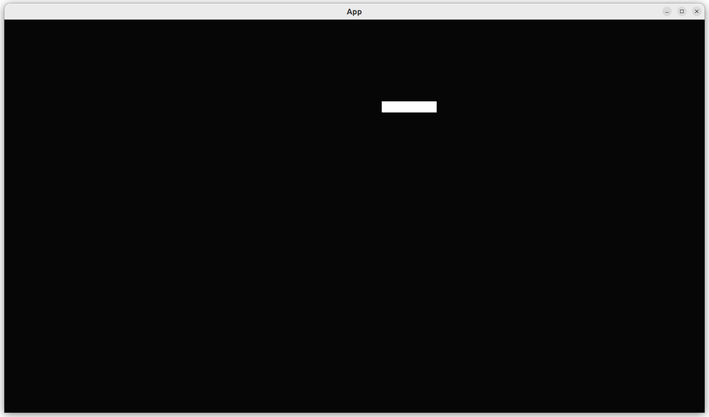

# 2.8. Move a player

This chapter shows how to move a player.



The idea is to give a player a velocity,
making the player move on screen.

This chapter introduces:

- how to extend our own Bevy component
- adding an `Update` system

## 2.8.1. First test: an empty `App` has no players

Similar to all earlier chapters, we open
our test suite with counting the number
of players in an empty `App`:

```rust
fn test_empty_app_has_no_players() {
    let mut app = App::new();
    app.update();
    assert_eq!(count_n_players(&mut app), 0);
}
```

## 2.8.2. First fix

See the [`add_player`](add_player.md) chapter.

## 2.8.3. Second test: our `App` stores an initial velocity

The idea of this app is to give the player a velocity,
so that we can see it move.

Here we shorten two/three TDD tests into one (to save book pages,
not because it is good practice):

```rust
fn test_can_set_and_get_velocity() {
    let velocity = Vec2::new(1.2, 3.4);
    let mut app = create_app(velocity);
    app.update();
    assert_eq!(get_player_velocity(&mut app), velocity);
}
```

## 2.8.4. Second fix

To fix this, we'll need to:

- write a `Player` `Component` that can hold a velocity
- `create_app` must accept a velocity and add a `Player` component
  with that velocity to the world
- `get_player_velocity` must extract the velocity from our `Player` component

Writing a `Player` `Component` that can hold a velocity is hard
as extending any Rust structure:

```rust
#[derive(Component)]
pub struct Player {
    pub velocity: Vec2,
}
```

Because the game is 2D, the velocity is also in two dimensions.

Our `create_app` must accept a velocity and add a `Player` component
with that velocity to the world:

```rust
pub fn create_app(velocity: Vec2) -> App {
    let mut app = App::new();
    app.add_systems(Startup, move |commands: Commands| {
        add_player(commands, velocity);
    });
    app
}
```

Similar to earlier chapters, a closure is used to allow the `add_player`
function with two function arguments to fit in a system that uses only one.
We could have used a local closure too, but the `add_player` function
feels too long to fit in, as shown below.

Here is the `add_player` function:

```rust
fn add_player(mut commands: Commands, velocity: Vec2) {
    commands.spawn((
        SpriteBundle {
            transform: Transform {
                scale: Vec3::new(64.0, 32.0, 0.0),
                ..default()
            },
            ..default()
        },
        Player { velocity },
    ));
}
```

The `add_player` function adds a `SpriteBundle` with a `Player` component,
as we've done earlier. New is that we now initialize the `Player` component
too. You may have expected to see `velocity: velocity` as a syntax,
but, no, this is the proper Rust syntax :-) .

The `get_player_velocity` that extracts the velocity from our `Player`
component can be implemented like this:

```rust
fn get_player_velocity(app: &mut App) -> Vec2 {
    let mut query = app.world_mut().query::<&Player>();
    let player = query.single(app.world());
    player.velocity
}
```

We can directly query for a `Player` component, as we can be sure
other Bevy plugins will not add it for us.

## 2.8.5. Third test: our `App` has a player

We've been counting the number of players
since the [`add_player`](add_player.md) chapter:

```rust
fn test_create_app_has_a_player() {
    let velocity = Vec2::new(0.0, 0.0);
    let mut app = create_app(velocity);
    app.update();
    assert_eq!(count_n_players(&mut app), 1);
}
```

See the [`add_player`](add_player.md) chapter for its implementation.

## 2.8.6. Fourth test: the player starts at the origin

We've been getting the position of the player
at the [`add_player_sprite`](add_player_sprite.md) chapter:

```rust
fn test_player_starts_at_the_origin() {
    let velocity = Vec2::new(0.0, 0.0);
    let mut app = create_app(velocity);
    app.update();
    assert_eq!(get_player_position(&mut app), Vec2::new(0.0, 0.0));
}
```

See the [`add_player_sprite`](add_player_sprite.md) chapter for its
implementation.

## 2.8.7. Fifth test: a player moves

Now we have all the pieces in place to test for movement:

```rust
fn test_player_moves() {
    let velocity = Vec2::new(1.2, 3.4);
    let mut app = create_app(velocity);
    app.update(); // moves the player
    assert_ne!(get_player_position(&mut app), Vec2::new(0.0, 0.0));
}
```

The test is generous, as it only checks that the player changes position.
Instead, it could have tested that the position of the player would be,
say, at `(1.2, 3.4)`. Such a specific test would be fragile, as adding
forces such as friction and/or gravity would cause the test to break.
The test shown here is enough to force us to add player movement,
hence we'll stick with it. If we need precise movement tests, sure, go
ahead and add these!

## 2.8.8. Fifth fix

Making a player move is a (Bevy) system: it is a -typically-
function that works on entities in the world.
Unlike other earlier systems, moving a player needs to be done
every frame (instead of only at startup).
To specify this, use the `Update` `ScheduleLabel`:

```rust
pub fn create_app(velocity: Vec2) -> App {
    // ...
    app.add_systems(Update, move_player);
    // ...
}
```

The `move_player` function 'magically' has a `Query` as a function
argument:

```rust
fn move_player(mut query: Query<(&mut Transform, &Player)>) {
    let (mut player_sprite, player) = query.single_mut();
    player_sprite.translation.x += player.velocity.x;
    player_sprite.translation.y += player.velocity.y;
}
```

That function argument is the most interesting of the function:
`query` will contain all `Transforms` marked with a `Player`,
where -for the first time!- we can modify the `Transform`.

## 2.8.9. `main.rs`

To see that it works, this is the code we can use:

```rust
fn main() {
    let velocity = Vec2::new(0.2, 0.1);
    let mut app = create_app(velocity);
    let add_camera_fun = |mut commands: Commands| {
        commands.spawn(Camera2dBundle::default());
    };
    app.add_systems(Startup, add_camera_fun);
    app.add_plugins(DefaultPlugins);
    app.run();
}

```

We can indeed see our player move:


## 2.8.10. Conclusion

We can now create an `App` with one player sprite that moves.
When running the `App`, we can see the player moves.
We have tested everything that the App does!

Full code can be found at [https://github.com/richelbilderbeek/bevy_tdd_book_move_player](https://github.com/richelbilderbeek/bevy_tdd_book_move_player).
