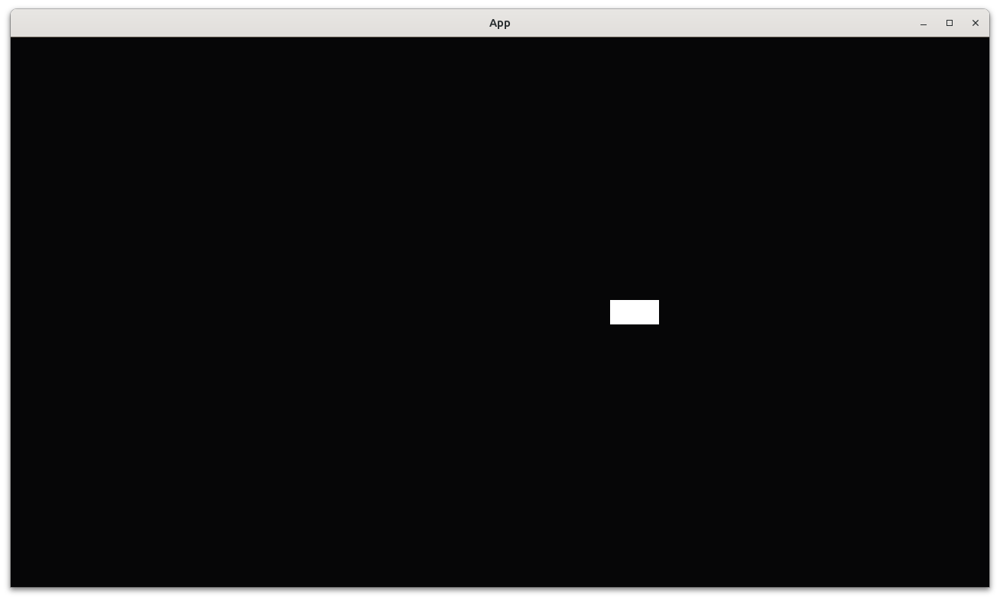

# Respond to a key press

This chapter shows how to respond to a key press as done on a keyboard.

!!! note "Not ready for yet"

    This section remains unfinished until feedback about the previous sections
    has been received.

The idea is to do something upon a key press.

This chapter introduces:

- TODO

## Second test: an empty `App` has no players

```rust
fn test_empty_app_has_no_players() {
    let mut app = App::new();
    assert_eq!(count_n_players(&mut app), 0);
}
```

## Third test: an `App` has a player

```rust
fn test_create_app_has_a_player() {
    let mut app = create_app();
    app.update();
    assert_eq!(count_n_players(&mut app), 1);
}
```

## Fourth test: an `App` has a player placed at the origin

```rust
fn test_player_is_at_origin() {
    let mut app = create_app();
    app.update();
    assert_eq!(get_player_position(&mut app), Vec2::new(0.0, 0.0));
}
```

## Fifth test: pressing spacebar moves the player

```rust
fn test_player_responds_to_key_press() {
    let mut app = create_app();
    assert!(app.is_plugin_added::<InputPlugin>());
    app.update();

    // Not moved yet
    assert_eq!(get_player_position(&mut app), Vec2::new(0.0, 0.0));

    // Press the right arrow button, thanks Periwinkle
    app.world_mut()
        .resource_mut::<ButtonInput<KeyCode>>()
        .press(KeyCode::Space);

    app.update();

    // Position must have changed now
    assert_ne!(get_player_position(&mut app), Vec2::new(0.0, 0.0));
}
```

## `main.rs`

```rust
fn main() {
    let mut app = create_app();
    let add_camera_fun = |mut commands: Commands| {
        commands.spawn(Camera2dBundle::default());
    };
    app.add_systems(Startup, add_camera_fun);
    app.add_plugins(DefaultPlugins);
    app.run();
}
```



## Conclusion

We can now create an `App` with something that responds
to a key press.
We have tested everything that the `App` does!

Full code can be found at [https://github.com/richelbilderbeek/bevy_tdd_book_respond_to_key_press](https://github.com/richelbilderbeek/bevy_tdd_book_respond_to_key_press).
