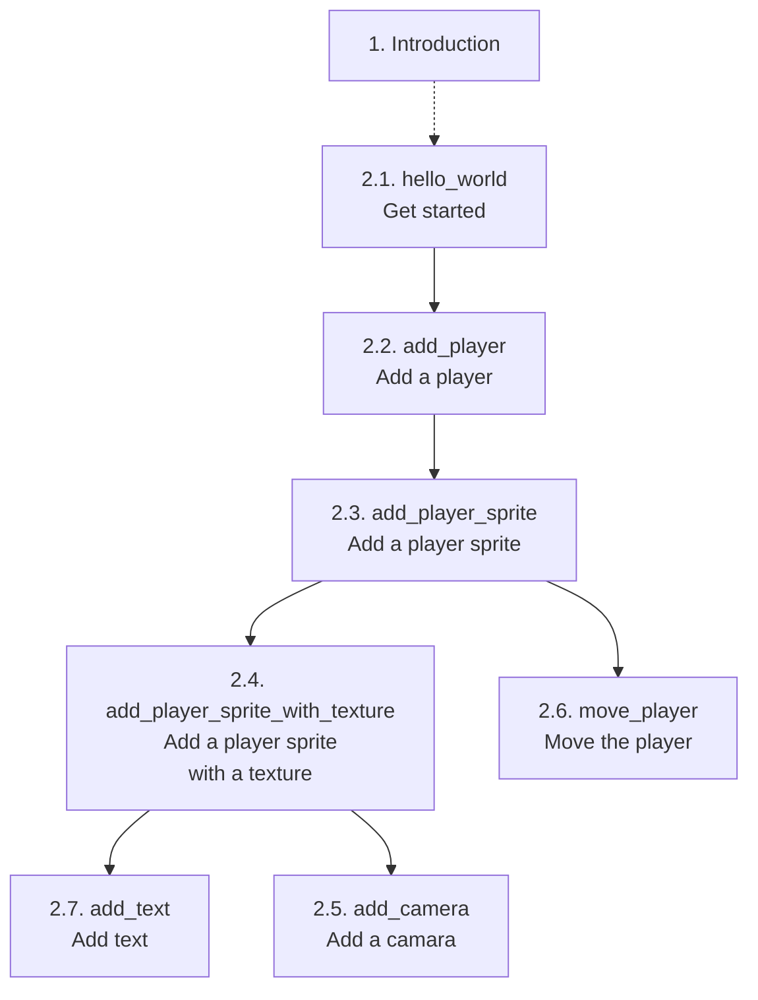

# Welcome to 'Developing Bevy games using TDD'

Start of a book [1] called 'Developing Bevy games using TDD'.
The goal is to demonstrate how to do Test-Driven Development with Bevy.

## Footnotes

- [1] 'book' is an overstatement for now: it is just a collection of notes

