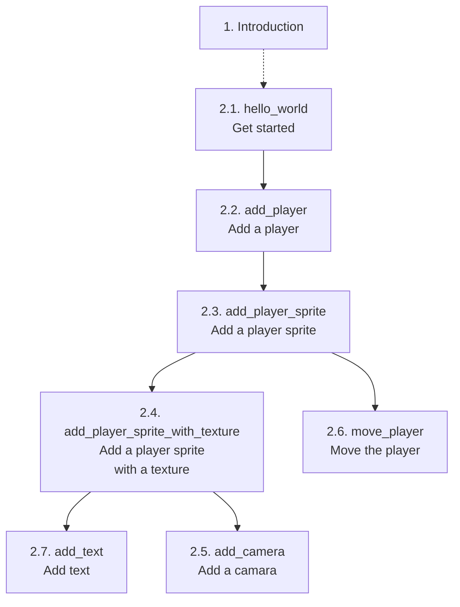

# Section 2: Basics

```mermaid
flowchart TD
  introduction[1. Introduction]
  hello_world[2.1. hello_world\nGet started]
  add_player[2.2. add_player\nAdd a player]
  add_player_sprite[2.3. add_player_sprite\nAdd a player sprite]
  add_player_sprite_with_texture[2.4. add_player_sprite_with_texture\nAdd a player sprite\nwith a texture]
  add_camera[2.5. add_camera\nAdd a camara]
  move_player[2.6. move_player\nMove the player]
  add_text[2.7. add_text\nAdd text]

  introduction -.-> hello_world
  hello_world --> add_player
  add_player --> add_player_sprite
  add_player_sprite --> add_player_sprite_with_texture
  add_player_sprite_with_texture --> add_text
  add_player_sprite_with_texture --> add_camera
  add_player_sprite --> move_player
```
