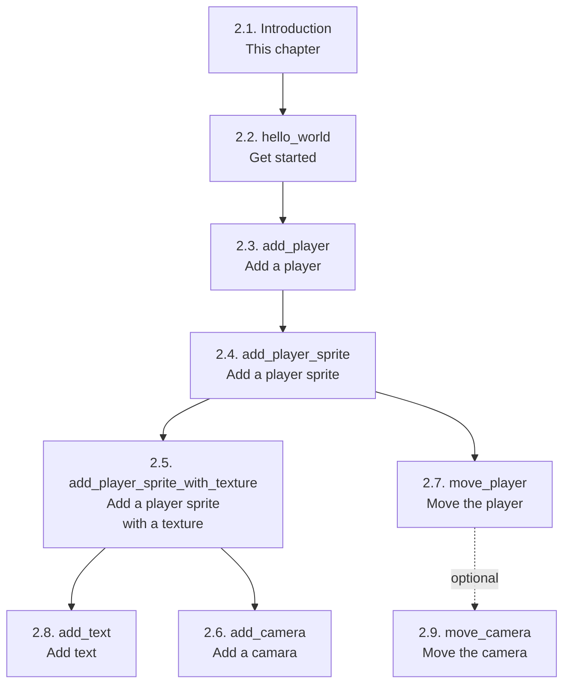

# 2.1. Introduction

In this section, we start building simple Bevy programs,
using test-driven development and gradually introducing
Bevy terminology.

Here you can see the recommended reading order of chapters:

