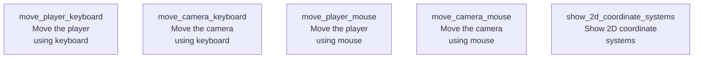

# Example programs

This section only shows (more) complete example programs.

!!! note "Not ready for yet"

    This section remains unfinished until feedback about the previous sections
    has been received.

This section has no recommended order of reading yet.

