# Section 3: Respond to input

In this section, we start building simple Bevy programs
that respond to user input.

!!! note "Not ready for yet"

    This section remains unfinished until feedback about the previous sections
    has been received.

This section has no recommended order of reading yet.

```mermaid
flowchart TD
  respond_to_key_press[respond_to_key_press\nRespond to a\nkey press]
  respond_to_mouse_move[respond_to_mouse_move\nRespond to a\nmouse move]
  respond_to_mouse_button_press[respond_to_mouse_button_press\nRespond to a\nmouse button press]
  respond_to_mouse_wheel_press[respond_to_mouse_wheel_press\nRespond to a\nmouse wheel press]
  respond_to_mouse_wheel_turn[respond_to_mouse_wheel_turn\nRespond to a\nmouse wheel turn]
  respond_to_just_key_pressed[respond_to_just_key_pressed\nRespond to a key\nthat has just been pressed]
  respond_to_window_resize[respond_to_window_resize\nRespond to a window\nthat resizes]
```

