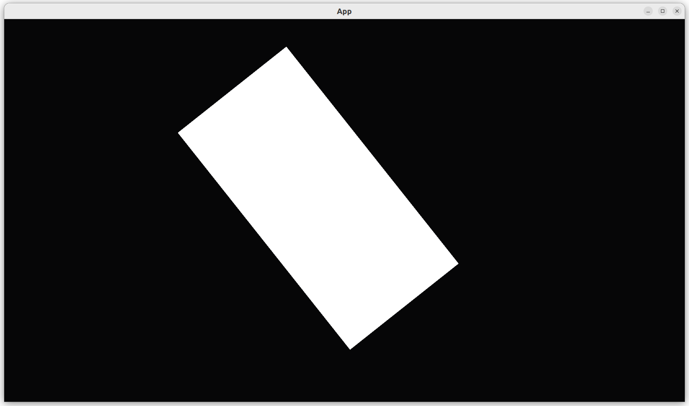

# Move a camera with a keyboard

This chapter shows how to move a camera with a keyboard.

The idea is to change the camera's position, rotation and zoom upon a key press.


## First test: an empty `App` has no cameras

```rust
fn test_empty_app_has_no_cameras() {
    let mut app = App::new();
    assert_eq!(count_n_cameras(&mut app), 0);
}
```

## Second test: our `App` has one camera

```rust
fn test_create_app_has_a_moving_camera() {
    let mut app = create_app();
    app.update();
    assert_eq!(count_n_cameras(&mut app), 1);
}
```

## Third test: our player is at the origin


```rust
fn test_player_is_at_origin() {
    let mut app = create_app();
    app.update();
    assert_eq!(get_player_position(&mut app), Vec2::new(0.0, 0.0));
}
```

## Fourth test: our player has a proper size

```rust
fn test_player_has_a_custom_scale() {
    let mut app = create_app();
    app.update();
    assert_eq!(get_player_scale(&mut app), Vec2::new(64.0, 32.0));
}
```

## Fifth test: our camera starts at the origin

```rust
fn test_camera_is_at_origin() {
    let mut app = create_app();
    app.update();
    assert_eq!(get_camera_position(&mut app), Vec2::new(0.0, 0.0));
}
```

## Sixth test: our camera moves when pressing the arrow up key


```rust
fn test_camera_moves_when_pressed_up() {
    let mut app = create_app();
    app.update();
    assert_eq!(get_camera_position(&mut app), Vec2::new(0.0, 0.0));

    // Press the key
    app.world_mut()
        .resource_mut::<ButtonInput<KeyCode>>()
        .press(KeyCode::ArrowUp);
    app.update();
    assert_ne!(get_camera_position(&mut app), Vec2::new(0.0, 0.0));

}
```


## Seventh test: our camera is not rotated at the start

```rust
fn test_camera_is_not_rotated_at_start() {
    let mut app = create_app();
    app.update();
    assert_eq!(get_camera_rotation(&mut app), 0.0);
}
```

## Eighth test: our camera rotates when pressing the Q key


```rust
fn test_camera_rotates_when_pressed_q() {
    let mut app = create_app();
    app.update();
    assert_eq!(get_camera_rotation(&mut app), 0.0);

    // Press the key
    app.world_mut()
        .resource_mut::<ButtonInput<KeyCode>>()
        .press(KeyCode::KeyQ);
    app.update();

    assert_ne!(get_camera_rotation(&mut app), 0.0);
}
```

## Ninth test: our camera is not zoomed in or out at the start

```rust
fn test_camera_is_not_zoomed_in_or_out_at_start() {
    let mut app = create_app();
    app.update();
    assert_eq!(get_camera_zoom(&mut app), 1.0);
}
```

## Tenth test: our camera zooms in when pressing the W key

```rust
fn test_camera_zooms_in_when_pressed_w() {
    let mut app = create_app();
    app.update();
    assert_eq!(get_camera_zoom(&mut app), 1.0);

    // Press the key
    app.world_mut()
        .resource_mut::<ButtonInput<KeyCode>>()
        .press(KeyCode::KeyW);
    app.update();

    assert!(get_camera_zoom(&mut app) < 1.0);
}
```

## Eleventh test: our camera zooms out when pressing the S key

```rust
fn test_camera_zoom_out_when_pressed_s() {
    let mut app = create_app();
    app.update();
    assert_eq!(get_camera_zoom(&mut app), 1.0);

    // Press the key
    app.world_mut()
        .resource_mut::<ButtonInput<KeyCode>>()
        .press(KeyCode::KeyS);
    app.update();

    assert!(get_camera_zoom(&mut app) > 1.0);
}
```

## `main.rs`

Running the application shows the camera movement in action.



## Conclusion

We can now create an `App` with a camera that responds to key presses.
We have tested everything that the `App` does!

Full code can be found at [https://github.com/richelbilderbeek/bevy_tdd_book_move_camera_with_keyboard](https://github.com/richelbilderbeek/bevy_tdd_book_move_camera_with_keyboard).
