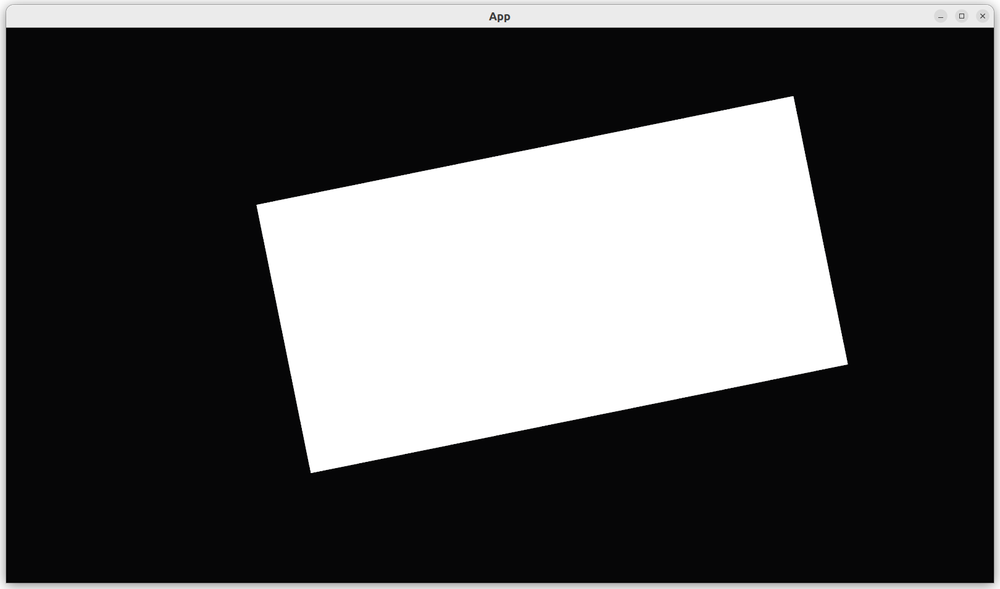

# Move a camera with a mouse

This chapter shows how to move a camera with a mouse.

The idea is to change the camera's position, rotation and zoom upon mouse input.

These tests are the same as in the minimal examples.

## `main.rs`

```rust
fn main() {
    let mut app = create_app();
    app.add_plugins(DefaultPlugins);
    app.run();
}
```

Running the application shows the camera movement in action.



## Conclusion

We can now create an `App` with a camera that responds to key presses.
We have tested everything that the `App` does!

Full code can be found at [https://github.com/richelbilderbeek/bevy_tdd_book_move_camera_with_mouse](https://github.com/richelbilderbeek/bevy_tdd_book_move_camera_with_mouse).
