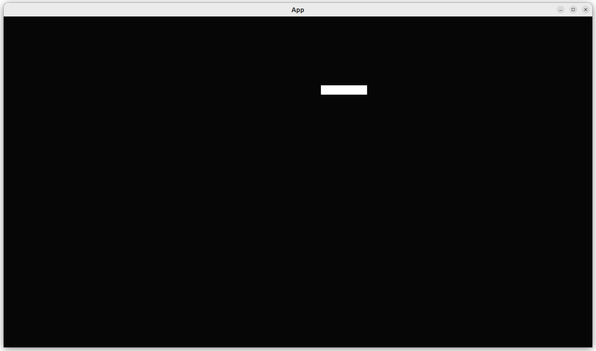

# Move a player

This chapter shows how to move a player.

The idea is to give a player a velocity,
making the player move on screen.

## First test: add `initial_player_velocity` to `GameParameters`

In `game_parameter.rs`:

```rust
#[test]
fn test_initial_player_velocity() {
    assert_eq!(
        create_default_game_parameters().initial_player_velocity,
        Vec2::new(0.0, 0.0)
    );
}
```

## First fix

Add `initial_player_velocity` to the structure `GameParameters`:

```rust
pub struct GameParameters {
    pub initial_player_position: Vec3,
    pub initial_player_scale: Vec3,
    pub initial_player_velocity: Vec2,
}
``

Add `initial_player_velocity` to the function `create_default_game_parameters`:

```rust
#[cfg(test)]
pub fn create_default_game_parameters() -> GameParameters {
    return GameParameters {
        initial_player_position: Vec3::new(0.0, 0.0, 0.0),
        initial_player_scale: Vec3::new(100.0, 20.0, 1.0),
        initial_player_velocity: Vec2::new(0.0, 0.0),
    };
}
```

## Second test

To ease testing, we'll create a function to create `GameParameters`
in which a player has a non-zero velocity:

In `game_parameter.rs`:

```rust
#[test]
fn test_create_default_game_parameters_with_player_velocity() {
    let velocity = Vec2::new(1.1, 2.2);
    let params = create_default_game_parameters_with_player_velocity(velocity);
    assert_eq!(velocity, params.initial_player_velocity);
}
```

## Second fix

Here we create a default `GameParameters`, then change the specific
part we want to change:

```rust
pub fn create_default_game_parameters_with_player_velocity(
    initial_player_velocity: Vec2,
) -> GameParameters {
    let mut p = create_default_game_parameters();
    p.initial_player_velocity = initial_player_velocity;
    return p;
}
```

## Third test

Up until now, a `Player` was an empty structure.
A `Player` was paired with a `SpriteBundle` and things that
could be put in the `SpriteBundle` were put there:
the position (called 'translation') and the size (called 'scale').

However, a `SpriteBundle` does not have a velocity.
Hence, we do need to put this into the `Player` class.

In `player.rs` we have put these two tests:

```rust
#[test]
fn test_create_default_player() {
    create_default_player();
}
#[test]
fn test_initial_player_velocity() {
    assert_eq!(create_default_player().velocity, Vec2::new(0.0, 0.0));
}
```

## Third fix

```rust
/// Player elements that cannot be put in a SpriteBundle
#[derive(Component)]
pub struct Player {
    pub velocity: Vec2,
}

#[cfg(test)]
pub fn create_default_player() -> Player {
    Player {
        velocity: Vec2::new(0.0, 0.0),
    }
}
```

## Fourth test

Now that a `Player` has a velocity, in `app.rs`,
we have all that is needed in place to dare to test the player to move:

```rust
#[test]
fn test_player_moves() {
    use create_default_game_parameters as create_params;
    let params = create_default_game_parameters_with_player_velocity(Vec2::new(1.1, 2.2));
    let mut app = create_app(params);
    app.update(); // Already moves the player
    assert_ne!(
        create_params().initial_player_position,
        get_player_coordinat(&mut app)
    );
}
```

It is an imprecise test. We'll write a more precise test later.

## Fourth fix

We need to add a system to move the player, called `move_player`:

```rust
pub fn create_app(game_parameters: GameParameters) -> App {
    let mut app = App::new();
    let add_player_fn = move |/* no mut? */ commands: Commands| {
        add_player_from_parameters(commands, &game_parameters);
    };
    app.add_systems(Startup, add_player_fn);
    app.add_systems(Update, move_player);

    // Do not do update, as this will disallow to do more steps
    // app.update(); //Don't!
    return app;
}
```

Here is how that function looks like:

```rust
fn move_player(mut query: Query<(&mut Transform, &Player)>) {
    let (mut player_sprite, player) = query.single_mut();
    player_sprite.translation.x += player.velocity.x;
    player_sprite.translation.y += player.velocity.y;
}
```

The argument, a `Query` is generic type taking 0, 1, 2 or more types.

In our case, the `Query` looks for all spawned Components with
a `Transform` and a `Player`.

The `add_player_from_parameters` did exactly that:
it spawned a `SpriteBundle` and a `Player`. However,
a `SpriteBundle` is not a `Component`, but a `Bundle` of `Components`
instead. A `SpriteBundle` bundles multiple `Components`, among other
a `Transform`. Hence, we spawned a `Player`, a `Transform` and other
`SpriteBundle` components. Due to this, a `Query` using
a `Player` and `Transform` `Component` will give is the info we need here.

```rust
fn add_player_from_parameters(mut commands: Commands, parameters: &GameParameters) {
    commands.spawn((
        SpriteBundle {
            transform: Transform {
                translation: parameters.initial_player_position,
                scale: parameters.initial_player_scale,
                ..default()
            },
            ..default()
        },
        Player {
            velocity: parameters.initial_player_velocity,
        },
    ));
}
```

## Intermezzo: seeing all Components

This is a [function](functions.md) that can be used to print
all `Components` of an `App`:

```rust
fn print_all_components_names(app: &App) {
    for c in app.world.components().iter() {
        println!("{}", c.name())
    }
}
```

Using it in a test:

```rust
#[test]
fn test_print_all_components_names() {
    let mut app = create_app(create_default_game_parameters());
    app.update();
    print_all_components_names(&app);
}
```

Results in:

```text
bevy_ecs::schedule::schedule::Schedules
bevy_ecs::reflect::AppTypeRegistry
bevy_app::main_schedule::MainScheduleOrder
bevy_app::main_schedule::FixedMainScheduleOrder
bevy_ecs::event::Events<bevy_app::app::AppExit>
bevy_ecs::schedule::stepping::Stepping
bevy_sprite::sprite::Sprite
bevy_transform::components::transform::Transform
bevy_transform::components::global_transform::GlobalTransform
bevy_asset::handle::Handle<bevy_render::texture::image::Image>
bevy_render::view::visibility::Visibility
bevy_render::view::visibility::InheritedVisibility
bevy_render::view::visibility::ViewVisibility
bevy_tdd_book_add_player_sprite::player::Player
bevy_ecs::event::EventUpdateSignal
```

Within these, we can find the `Components` of the `SpriteBundle`,
which are `Sprite`, `Transform`, `GlobalTransform`, `Handle<Image>`,
`Visibility`, `InheritedVisibility` and `ViewVisibility`.

Also, we can found our own `Player` `Component`.

## `main.rs`

To see that it works, this is the code we can use:

```rust
fn main() {
    let mut app = create_app(create_default_game_parameters_with_player_velocity(
        Vec2::new(1.1, 2.2),
    ));
    let add_camera_fun = |mut commands: Commands| {
        commands.spawn(Camera2dBundle::default());
    };
    app.add_systems(Startup, add_camera_fun);
    app.add_plugins(DefaultPlugins);
    app.run();
}
```

We can indeed see our player move:



## Fifth test: precise movement

This test will pass directly if you implemented the previous one correctly.
I show it here for documentation purposes:

```rust
#[test]
fn test_player_moves_in_a_line() {
    use create_default_game_parameters as create_params;
    let velocity = Vec2::new(1.1, 2.2);
    let params = create_default_game_parameters_with_player_velocity(velocity);
    let mut app = create_app(params);
    app.update(); // Already moves the player
    let expected_pos =
        create_params().initial_player_position + Vec3::new(velocity.x, velocity.y, 0.0);
    assert_eq!(expected_pos, get_player_coordinat(&mut app));
}
```

It is up to you to keep it for documentation purposes,
as it proves that a player moves in a straight line.

However, this test is fragile: there will probably be more forces
that will work on the player (e.g. gravity). When that happens,
this tests becomes obsolete and can/should be deleted.

## Conclusion

We can now create an `App` with one player sprite that moves.
When running the `App`, we can see the player moves.
We have tested everything that the App does!

Full code can be found at [https://github.com/richelbilderbeek/bevy_tdd_book_move_player](https://github.com/richelbilderbeek/bevy_tdd_book_move_player).
