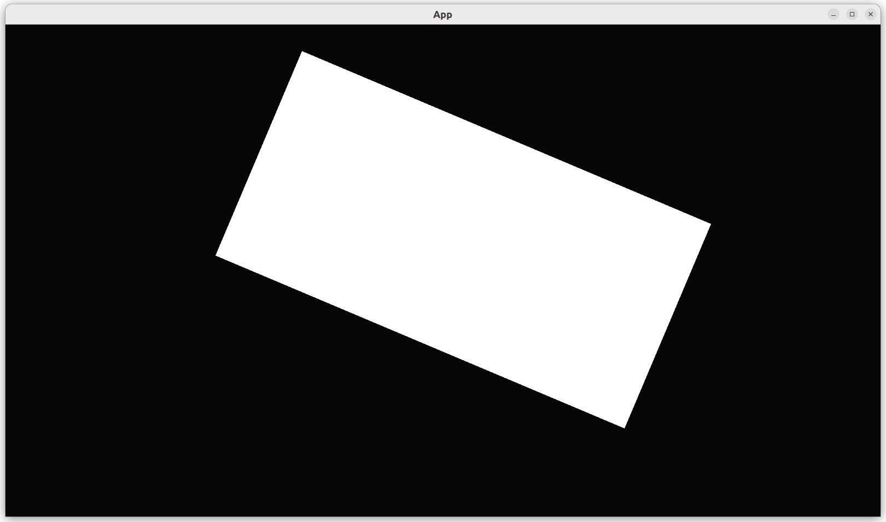

# Move a camera with a keyboard

This chapter shows how to move a camera with a keyboard.

The idea is to change the camera's position, rotation and zoom upon a key press.

## First test: an empty `App` has no players

```rust
fn test_empty_app_has_no_players() {
    let mut app = App::new();
    app.update();
    assert_eq!(count_n_players(&mut app), 0);
}
```

## Second test: our `App` has a players

```rust
fn test_create_app_has_a_player() {
    let mut app = create_app();
    app.update();
    assert_eq!(count_n_players(&mut app), 1);
}
```

## Third test: the player starts at the origin

```rust
fn test_player_is_at_origin() {
    let mut app = create_app();
    app.update();
    assert_eq!(get_player_position(&mut app), Vec2::new(0.0, 0.0));
}

```

## Fourth test: the player moves position when mouse moves

```rust
fn test_player_responds_to_mouse_move() {
    let mut app = create_app();
    app.update();
    assert_eq!(get_player_position(&mut app), Vec2::new(0.0, 0.0));

    // Move the mouse
    app.world_mut().send_event(bevy::input::mouse::MouseMotion {
        delta: Vec2::new(100.0, 100.0),
    });

    app.update();
    assert_ne!(get_player_position(&mut app), Vec2::new(0.0, 0.0));
}
```

## Fifth test: the player is not rotated at the start

```rust
fn test_player_is_not_rotated_at_start() {
    let mut app = create_app();
    app.update();
    assert_eq!(get_player_rotation(&mut app), 0.0);
}
```

## Six test: pressing a mouse button rotates the player

```rust
fn test_player_responds_to_left_mouse_button_press() {
    let mut app = create_app();
    assert!(app.is_plugin_added::<bevy::input::InputPlugin>());
    app.update();

    // Not moved yet
    assert_eq!(get_player_rotation(&mut app), 0.0);

    // Press the left mouse button
    app.world_mut()
        .resource_mut::<ButtonInput<MouseButton>>()
        .press(MouseButton::Left);

    app.update();

    // Position must have changed now
    assert_ne!(get_player_rotation(&mut app), 0.0);
}
```

## Seventh test: the player has an initial size

```rust
fn test_player_has_a_custom_size() {
    let mut app = create_app();
    app.update();
    assert_eq!(get_player_size(&mut app), Vec2::new(64.0, 32.0));
}
```

## Eight test: the player changes size when the mousewheel is turned

```rust
fn test_player_responds_to_mouse_wheel_turn() {
    let mut app = create_app();
    assert!(app.is_plugin_added::<bevy::input::InputPlugin>());
    app.update();

    // Not moved yet
    assert_eq!(get_player_size(&mut app), Vec2::new(64.0, 32.0));

    // Scroll the mouse
    app.world_mut().send_event(bevy::input::mouse::MouseWheel {
        unit: bevy::input::mouse::MouseScrollUnit::Line,
        x: 10.0,
        y: 10.0,
        window: Entity::PLACEHOLDER,
    });
    app.update();

    // Moved now
    assert_ne!(get_player_size(&mut app), Vec2::new(64.0, 32.0));
}
```

## `main.rs`

```rust
fn main() {
    let mut app = create_app();
    let add_camera_fun = |mut commands: Commands| {
        commands.spawn(Camera2dBundle::default());
    };
    app.add_systems(Startup, add_camera_fun);
    app.add_plugins(DefaultPlugins);

    app.run();
}
```

Running the application shows the player movement in action.



## Conclusion

We can now create an `App` with a camera that responds to key presses.
We have tested everything that the `App` does!

Full code can be found at [https://github.com/richelbilderbeek/bevy_tdd_book_move_player_with_mouse](https://github.com/richelbilderbeek/bevy_tdd_book_move_player_with_mouse).
