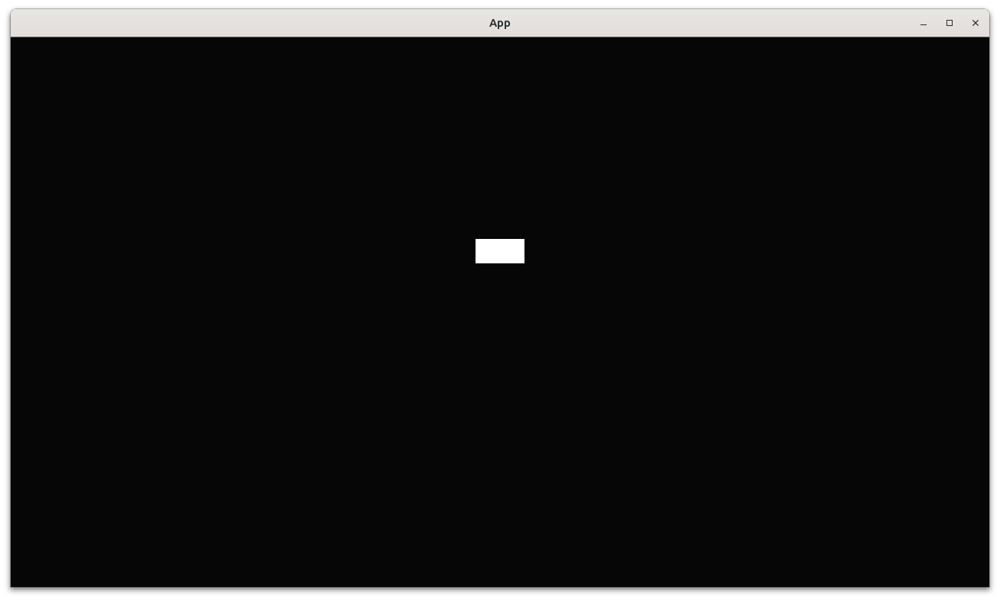

# Respond to a key just being pressed

This chapter shows how to respond to a key that is just being
pressed on a keyboard.

The idea is to do something upon a key just being pressed.

## First test: an empty `App` has no players

```rust
fn test_empty_app_has_no_players() {
    let mut app = App::new();
    assert_eq!(count_n_players(&mut app), 0);
}

```

## Second test: an `App` has a player

```rust
fn test_create_app_has_a_player() {
    let mut app = create_app();
    app.update();
    assert_eq!(count_n_players(&mut app), 1);
}
```

## Fourth test: an `App` has a player placed at the origin

```rust
fn test_player_is_at_origin() {
    let mut app = create_app();
    app.update();
    assert_eq!(get_player_position(&mut app), Vec2::new(0.0, 0.0));
}

```

## Fifth test: pressing spacebar moves the player

```rust
#[test]
fn test_player_responds_to_just_key_press() {
    let mut app = create_app();
    assert!(app.is_plugin_added::<InputPlugin>());
    app.update();

    // Not moved yet
    assert_eq!(get_player_position(&mut app), Vec2::new(0.0, 0.0));

    // Press the Enter button, thanks kristoff3r
    app.world_mut()
        .send_event(bevy::input::keyboard::KeyboardInput {
            key_code: KeyCode::Space,
            logical_key: Key::Space,
            state: bevy::input::ButtonState::Pressed,
            window: Entity::PLACEHOLDER,
        });

    app.update();

    // Moved now
    assert_ne!(get_player_position(&mut app), Vec2::new(0.0, 0.0));
}
```

## `main.rs`



## Conclusion

We can now create an `App` with something that responds
to a key press.
We have tested everything that the `App` does!

Full code can be found at [https://github.com/richelbilderbeek/bevy_tdd_book_respond_to_just_key_pressed](https://github.com/richelbilderbeek/bevy_tdd_book_respond_to_just_key_pressed).
