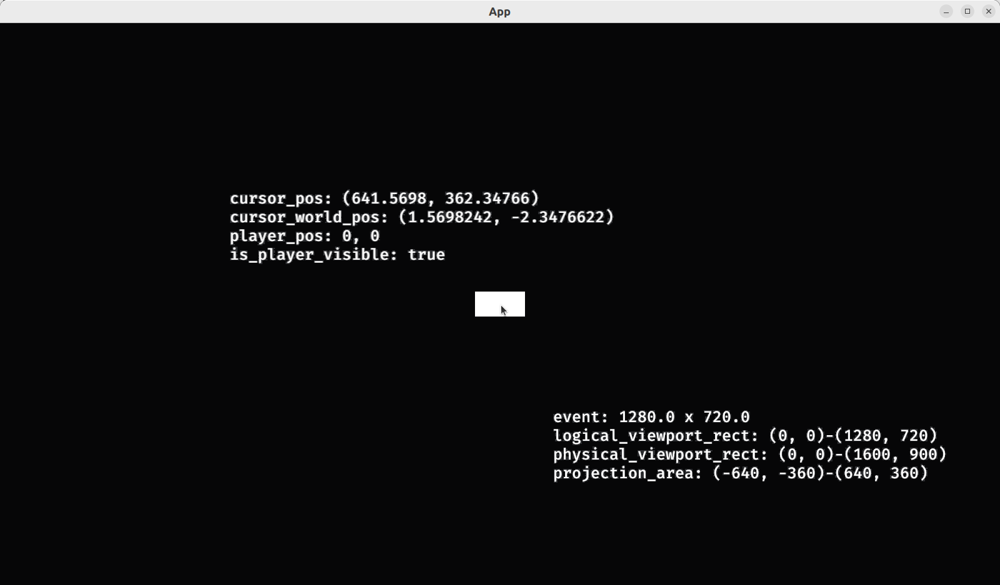

# Showing the 2D coordinate systems

This application is more of a demonstration.

To make the text nicely formatted, there are many `[something]_to_str` 
helper functions, such as:

```rust
fn test_coordinate_to_str() {
    assert_eq!(coordinate_to_str(Vec2::new(1.2, 3.4)), String::from("(1.2, 3.4)"))
}
```

and:

```rust
fn test_ucoordinate_to_str() {
    assert_eq!(ucoordinate_to_str(UVec2::new(1, 2)), String::from("(1, 2)"))
}
```


